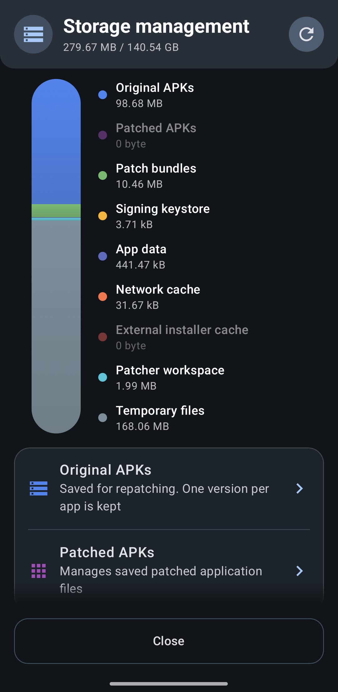

# Storage and saved data

Morphe keeps more than the app itself: the original APKs it patched, the patched results,
downloaded patch bundles, your keystore, and the patch selections you made per app. All of it
is visible, and most of it can be cleared, from **Settings → System → Files & storage**.

## Storage management

  

**Storage management** shows where the space went, broken down by category:

| Category | What it holds |
| --- | --- |
| **Original APKs** | Pre-patch files kept for repatching, one version per app |
| **Patched APKs** | Copies of the results, for export or reinstall |
| **Patch bundles** | The patches downloaded from your sources |
| **Signing keystore** | The key every patched APK is signed with |
| **App data** | Morphe's own settings and database |
| **Network cache** | HTTP responses cached to speed up updates |
| **External installer cache** | APK copies staged for third-party installers |
| **Patcher workspace** | Patcher runtime files and orphaned scratch data |
| **Temporary files** | Working files created during patching |

The last four are caches and clear individually. **Clear all caches** frees them in one go,
and Morphe spells out what that means: cached network responses, staged installer copies, and
temporary files go, while **original and patched APKs are kept**.

**Open Android app storage** hands you over to the system screen, where clearing data wipes
everything, including the keystore, see
[Backing up Morphe and your keystore](backup-and-keystore.md).

> [!TIP]
> If Morphe takes more space than you expect, it is almost always the saved APKs. A single
> patched YouTube is well over 150 MB, and Morphe may hold both the original and the result.

## Saved APKs

**Original APKs** and **Patched APKs** each open a list with per-app entries and their sizes,
plus the total at the top.

Each entry offers what makes sense for it: **Export** to write the APK somewhere, **Share**,
**Install** or **Reinstall** for a patched build, **Mount** for a root mount install,
**Uninstall**, and **Delete** to drop the saved copy. **Delete all** clears the whole list,
and you can export a selection as a zip, `morphe-patched-apks.zip` or
`morphe-original-apks.zip`.

Whether these copies are kept at all is controlled from the same dialogs:

- **Keep original APKs** - saves the pre-patch APK so repatching does not ask for the file
  again. One version per app is kept.
- **Keep patched APKs** - saves a copy of the result for later export or reinstall.

> [!NOTE]
> Deleting an original APK means the next patch of that app needs a fresh download, see
> [Updating a patched app](updating-patched-apps.md).

## Patch selections

**Patch selections** lists the patches and patch options you saved per app, grouped by the
source they came from. These survive uninstalling the patched app, which is what lets a
repatch reproduce your previous build.

Each entry expands into two sections, **Selected patches** and **Patch options**, so you can
see exactly what is stored before touching it.

The actions are:

- **Copy** - fills this entry from another patch source's saved selection, the same
  **Copy selection from another bundle** action offered on the Expert mode patch screen.
  Only patches that exist in both sources are copied.
- **Export** and **Import** - a JSON file of your selections and options. Importing asks
  whether to **Replace existing** or **Merge with existing**, exactly like the settings
  backup.
- **Reset** - drops what is saved, at the level you choose: a single source of one app, one
  app across all sources, the apps you selected, or everything at once. Morphe lists what
  will be deleted and asks for confirmation.

Resetting a selection does not touch the installed app. The next time you patch it, Expert
mode simply starts from the recommended selection again, see
[Patching an app in Expert mode](patching-expert-mode.md).

## Next steps

- [Backing up Morphe and your keystore](backup-and-keystore.md)
- [Updating a patched app](updating-patched-apps.md)
